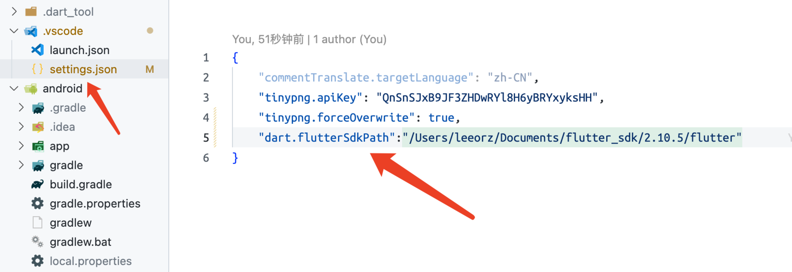

#### 1. 环境变量配置
```shell
# FLUTTER环境变量
FLUTTER_SDK_PATH=/Users/leeorz/Documents/flutter_sdk
# 稳定版
FLUTTER_STABLE_HOME=${FLUTTER_SDK_PATH}/github/flutter/bin
# 2.10.5稳定分支
FLUTTER_2_10_5_HOME=${FLUTTER_SDK_PATH}/2.10.5/flutter/bin

# 默认稳定版
export FLUTTER_HOME=${FLUTTER_STABLE_HOME}
# export PUB_HOSTED_URL=https://pub.flutter-io.cn
# export FLUTTER_STORAGE_BASE_URL=https://storage.flutter-io.cn
export PATH=${PATH}:${FLUTTER_HOME}


#切换到稳定版
alias flutter_switch_stable='export PATH=`echo $PATH | sed -e "s/${FLUTTER_HOME//\//\\/}/${FLUTTER_STABLE_HOME//\//\\/}/g"`;export FLUTTER_HOME=${FLUTTER_STABLE_HOME};'
#切换到2.10.5
alias flutter_switch_2_10_5='export PATH=`echo $PATH | sed -e "s/${FLUTTER_HOME//\//\\/}/${FLUTTER_2_10_5_HOME//\//\\/}/g"`;export FLUTTER_HOME=${FLUTTER_2_10_5_HOME};'
```
#### 2. vscode中配置settings.json
