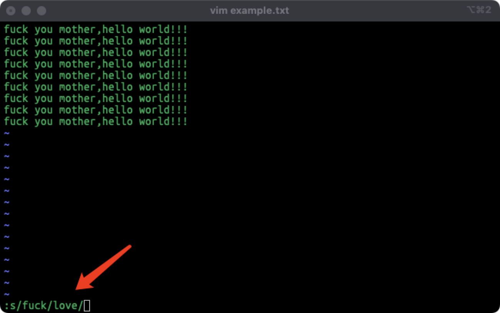
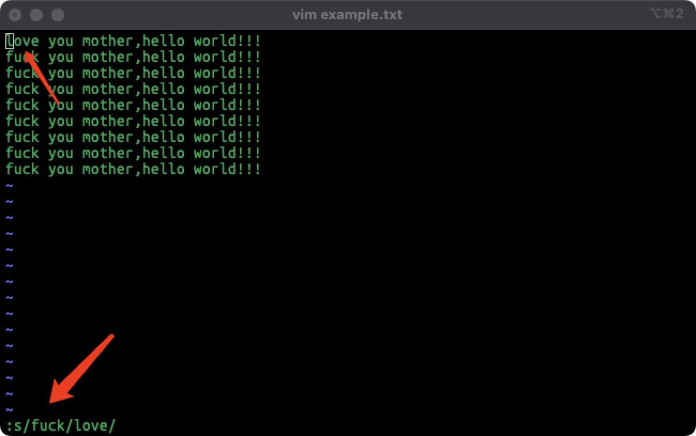

##### 查找
在normal模式下输入`/`+要查找的字符,查找方向:向下查找
在normal模式下输入`shift/`+要查找的字符,查找方向:向上查找
在查询出结果之后按`n`来直接跳转到匹配的字符串开头

##### 替换
输入`:`进入命令行模式
###### 替换光标所在行第一个str1为str2
```shell
s/str1/str2/
```



###### 替换光标所在行所有str1为str2
```shell
s/str1/str2/g
```
###### 替换第m行到第n行中每一行的第一个str1为str2
```shell
m,ns/str1/str2/
```
###### 替换第m行到第n行中所有的str1为str2
```shell
m,ns/str1/str2/g
```
###### 注:m和n为数字,若m为.则表示为当前行,若n为$则表示到最后一行
```shell
.,$s/str1/str2/g
```

###### 替换所有行中每一行的第一个str1为str2
```shell
%s/str1/str2/
```
###### 替换所有行中所有str1为str2
```shell
%s/str1/str2/g
```
##### 可以使用#做为分隔符,则中间出现的/不会做为分隔符
```shell
# 替换当前行第一个 str/ 为 str2/
s#str1/#str2/#
```
